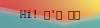

  

    
  

# Hi, Im Om

I'm working on contributing to open-source projects and working with web3js to make decentralized web apps!

## Current projects

- Cal.com (open-source)
- JSON Hero (open-source)
- Luminity (personal Sunsama clone using Next.js)

## Skills

  

    </img>
    </img>
    </img>
    </img>
    </img>
    </img>
    </img>
    </img>
    </img>
    </img>
    </img>
    </img>
    </img>
  

